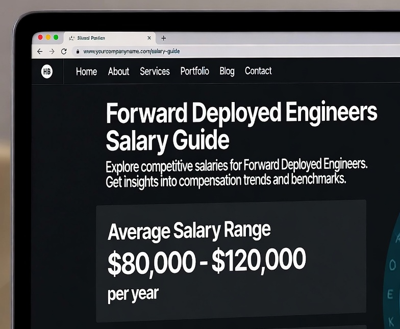

> 在当今快速变化的科技世界中，前沿部署工程师（FDE, Forward Deployed Engineer）扮演着极为重要的角色。他们是软件工程与现实应用之间的桥梁，尤其在人工智能（AI）驱动的领域中。这些专业人士与客户紧密合作，构建并落地复杂系统，满足企业对无缝集成的迫切需求。随着AI原生开发平台（AI Native Development Platform） 的兴起，FDE 成为了加速其应用与创新落地的关键力量，他们将创意概念转化为可扩展的商业解决方案。

## 什么是前沿部署工程师？起源与价值

前沿部署工程师（FDE）的角色最早出现在 2010 年代初，由Palantir创立，当时称为 “Delta”。这个岗位诞生的初衷是为了解决高级软件在复杂、现实环境中落地的难题——尤其是在国防、情报等数据密集型领域。

在 Palantir 的早期，FDE的人数一度超过传统软件工程师。直到 2016 年，公司产品架构调整，FDE 的职能才开始聚焦于深度集成与客户现场实施。本质上，FDE是一种融合了软件工程与客户现场部署能力的复合型角色：他们不仅编写代码，更深入客户现场，理解业务流程、调试系统、定制集成方案。这种混合型工作模式源于现实需求——传统组织往往层级复杂、流程缓慢，通用软件解决方案难以满足业务场景。

FDE的核心价值在于将复杂问题转化为切实可落地的成果。他们通过共同开发（co-development）和现场集成，加速产品采用、打通技术障碍、确保系统无缝运行。在AI产业中，模型往往需要根据业务场景定制，FDE正是推动AI平台落地、反馈产品优化、提升客户转化率的关键角色。随着AI向企业级应用深入发展，FDE 已成为创新转化的中坚力量。

<!--truncate-->

## 前沿部署工程师的核心职责与工作流程

前沿部署工程师的职责横跨工程、咨询与客户支持三个层面。他们的主要任务是深入客户团队，理解运营痛点、转化为技术需求，并完成从部署到优化的全生命周期落地。

典型流程如下：
在销售阶段，FDE参与技术可行性验证（POC）与性能基准测试；
项目启动后，他们负责系统分析、配置与数据集成；
在AI项目中，这通常包括构建智能代理、优化模型性能与保障数据安全。
部署完成后，FDE会持续监控运行状态，根据反馈优化方案，并将成果回馈至核心产品团队。

工作分配上，FDE的日常可能包括：
- 约 60% 投入在模型优化与系统配置；
- 20% 从事软件开发；
- 其余时间支持销售、处理故障或项目管理。

他们通常以小型敏捷团队形式工作，聚焦高影响力项目与短周期交付。这种模式强调快速原型设计（rapid prototyping）、高质量代码规范与主动问题解决能力，最终实现可量化的业务成果。

## 成功的FDE所需的关键技能与技术栈

要成为一名高效的FDE，需要兼具扎实的技术功底与优秀的软技能，他们的技术栈通常包括以下要素：

| 分类 | 技能 / 工具 | 重要程度 |
|------|---------------|-----------|
| 编程语言 | Python, Java, JavaScript, Apex | 高 |
| 云平台 | AWS, Azure, Google Cloud | 高 |
| AI 框架 | LangChain, TensorRT | 中 |
| 数据工具 | Snowflake, Databricks | 中 |
| 安全工具 | 加密技术、GDPR/SOC 2 合规 | 高 |
| 软技能 | 沟通能力、项目管理、适应力 | 高 |

安全技能是FDE职业技能要求中不可妥协的部分，由于FDE深度接触企业核心系统，他们必须熟悉数据加密、访问控制及国际合规标准（如GDPR、SOC2）。此外，熟练掌握开源工具链、版本控制（Git）及持续集成（CI/CD）也是他们的基础能力。

软技能对FDE来说同样重要。FDE需要能向非技术决策者解释复杂概念，具备跨部门协作和高压应对能力。他们的灵活性与沟通能力，使其能在客户与产品团队之间建立信任桥梁，成为长期合作的关键推动者。

## FDE与相关岗位的区别

FDE与传统软件工程师（SWE）最大的区别在于 “嵌入式客户工作”。SWE通常在内部团队中专注产品研发，而FDE则在客户现场进行实时定制与交付。他们不仅写代码，还在现场处理部署、调试与优化问题。

与解决方案工程师（SE）相比，FDE的工作更深入客户基础架构。SE主要提供顾问支持或概念验证，而FDE直接在客户生产系统中进行长期实施。顾问可能给出一次性建议，而FDE则长期嵌入，确保项目从部署到优化全过程成功。

这种实践性角色使 FDE 在复杂项目中不可替代。他们能在模糊、动态的环境中推动系统落地，让AI原生开发平台（AI Native Platform）真正实现价值，加速ROI回收并降低失败率。

## 薪资范围、职业发展与行业需求

FDE的薪资水平体现了其稀缺性与高技能要求。根据2025年Glassdoor与Levels.fyi数据，美国FDE的年薪范围为 15 万美元至 22 万美元，
包含奖金与股权后总收入可达 30 万美元以上。入门级薪资约为 14 万美元，高级岗位（尤其在加州等科技中心）则超过 25 万美元。

职业路径方面，FDE通常可晋升为技术架构师（Technical Architect）、产品经理（Product Manager）等领导岗位，或转向创业与独立咨询领域，利用其前线经验服务更多客户。

行业需求方面：
- 国防领域：2024 年全球网络安全投资达 372.3 亿美元，预计到 2032 年增至 668.9 亿美元，FDE被大量用于高安全集成。
- 金融行业：在合规要求与数据安全背景下，FDE负责落地AI系统以满足监管标准。
- 网络安全行业：预计到 2033 年市场规模达 788.5 亿美元，FDE需求快速上升。

根据《华尔街日报》2025 年数据，AI相关职位全球招聘量较三年前增长 1,066%，FDE成为其中增长最快的职位之一。

## FDE 的工作挑战

FDE 的工作模式带来了独特的挑战，频繁出差（约占工作时间的 25–50%）常导致身体疲劳与生活失衡，尤其是在偏远地区或高安全环境（如工厂、隔离网络系统）部署时。

同时，FDE需快速适应不同客户环境——从官僚体系的传统企业，到节奏极快的创业公司。这种频繁切换容易导致信息疲劳和倦怠。在客户需求变化频繁的情况下，他们还需在坚持工程规范与满足客户要求之间取得平衡。尤其在AI项目中，模型优化与交付周期往往紧张，给工程师带来巨大压力。建立清晰的项目流程与团队支持体系，是缓解这些问题的有效手段。

## FDE 如何利用AI原生开发平台（如JitAI）

AI 原生开发平台 与 FDE 的角色天然契合，它们帮助FDE简化模型部署、定制与维护流程，从而聚焦在价值交付而非基础设施运维上。以 [JitAI](https://jit.pro) 为例，该平台通过可视化编排和AI代码生成，实现开发效率提升 10 倍。FDE 可以利用其JAAP协议 实现系统级扩展，快速交付企业级 AI 解决方案。

在 MLOps（机器学习运维） 环境中，FDE 借助这些平台管理完整的数据生命周期，从建模、集成到部署，确保系统可扩展与安全性。例如，JitAI 提供的一键私有化与分布式集群功能，使部署周期大幅缩短并提高稳定性。FDE 在客户现场利用这些功能，可以快速原型化智能代理、优化流程，并基于实时反馈持续改进。

随着全球 AI 平台市场从 2024 年的 142.1 亿美元 增长至 2033 年的 2,510.1 亿美元（复合增长率 38.1%），借助 AI 原生平台的前沿部署工程师，正成为企业数字化转型的关键推动者。立即访问 [JitAI](https://jit.pro/download)，探索 AI 原生开发如何赋能前沿部署工程。